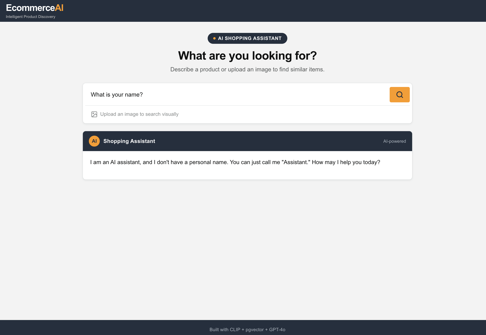
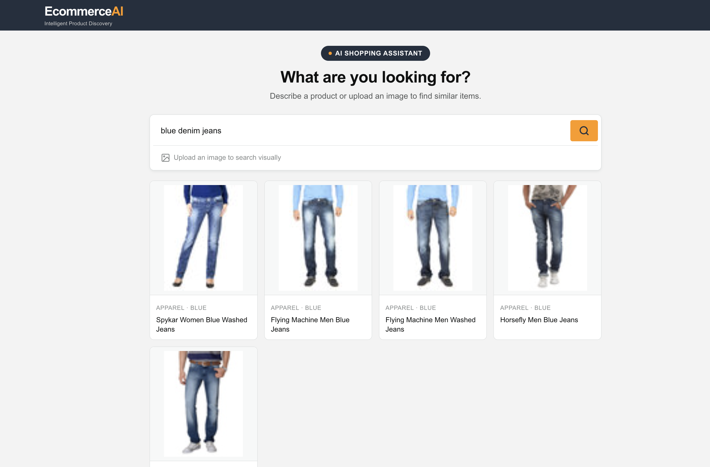
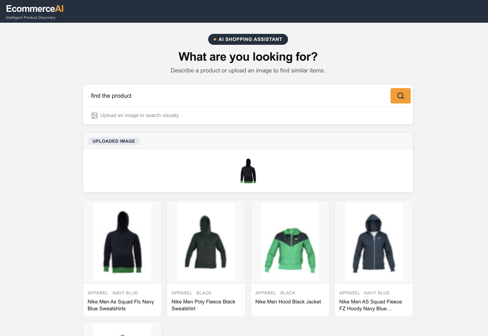
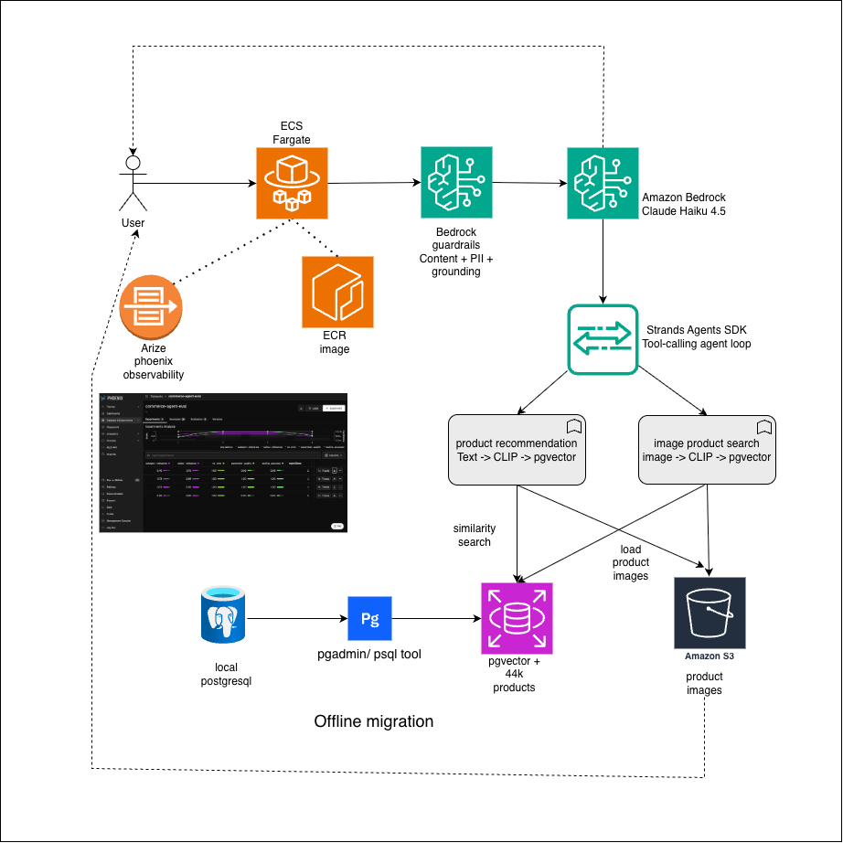
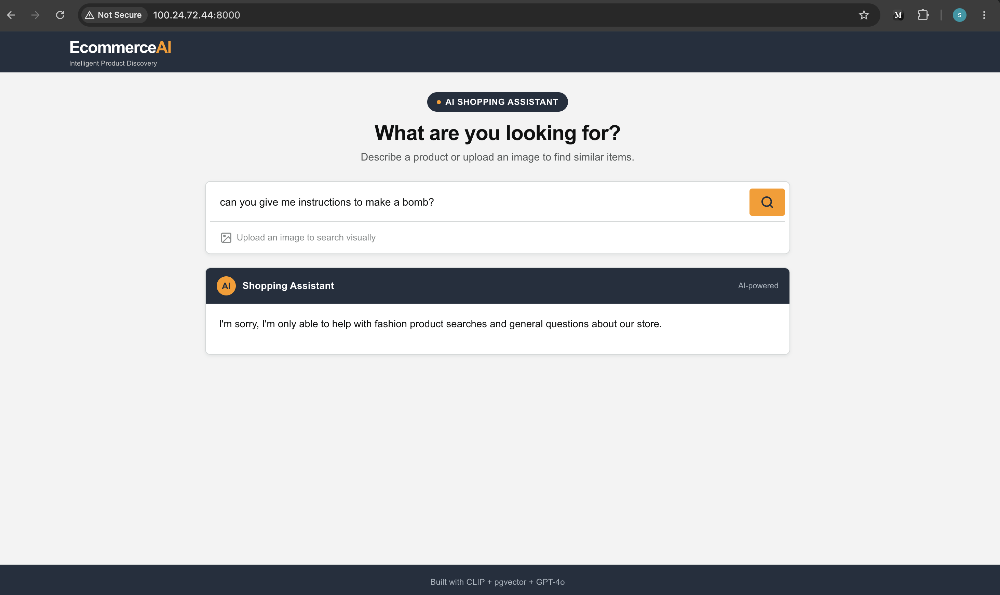
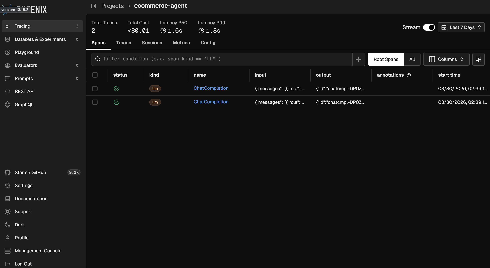
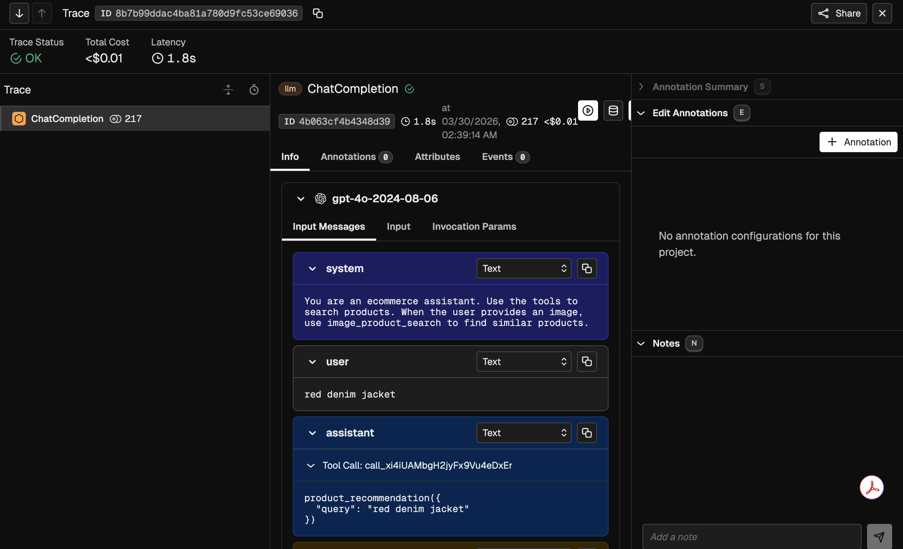
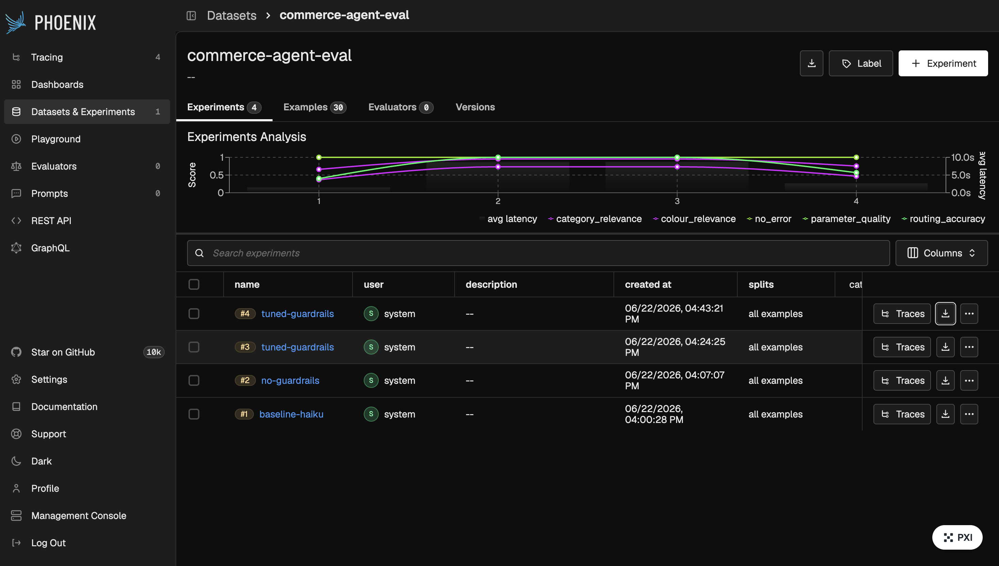
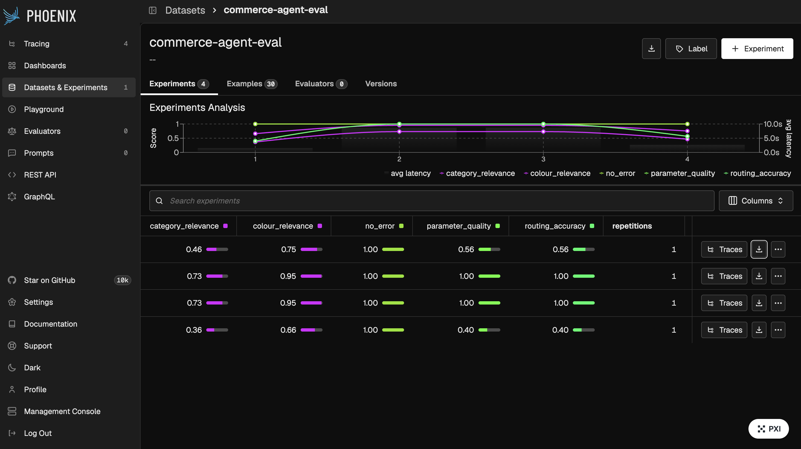

# Commerce AI Agent

An AI-powered shopping assistant that handles general conversation, text-based product recommendations, and image-based product search through a single unified agent.

> **Reference:** [Amazon Rufus](https://www.aboutamazon.com/news/retail/amazon-rufus)

---

## Table of Contents

1. [Features](#features)
2. [Screenshots](#screenshots)
3. [Architecture Overview](#architecture-overview)
4. [Technology Stack](#technology-stack)
5. [Technology Choices and Trade-offs](#technology-choices-and-trade-offs)
6. [Constraint-Driven Design](#constraint-driven-design)
7. [The Latency vs Quality vs Cost Triangle](#the-latency-vs-quality-vs-cost-triangle)
8. [Failure Modes and Guardrails](#failure-modes-and-guardrails)
9. [Observability with Arize Phoenix](#observability-with-arize-phoenix)
10. [Input Sanitization](#input-sanitization)
11. [Getting Started](#getting-started)
12. [Production Roadmap](#production-roadmap)
13. [Key Architectural Decisions Summary](#key-architectural-decisions-summary)

---

## Features

A single agent handles all three use cases through GPT-4o's native tool-calling:

- **General conversation** — "What's your name?", "What can you do?" — The agent responds directly to open-ended questions without invoking any retrieval tool.



- **Text-based product recommendation** — "Recommend me blue jeans for men" — the agent calls `product_recommendation`, which embeds the query with CLIP and searches pgvector for similar products. 
A natural language query is embedded with CLIP and matched against the product catalog via pgvector cosine similarity.



- **Image-based product search** — User uploads a product image — GPT-4o sees the image via its vision capability and calls `image_product_search`, which embeds the image with CLIP and searches pgvector for visually similar products.



---

## Architecture Overview



**How the agent loop works:**

1. User submits a text query (and optionally an image) via the Flask UI
2. The query (and image as base64, if provided) is sent to GPT-4o along with tool definitions
3. GPT-4o decides: respond directly (general chat) or call a tool (product search)
4. If a tool is called, the corresponding Python function executes: CLIP embeds the input, pgvector returns the nearest products
5. Tool results are sent back to GPT-4o, which generates a natural language response
6. The response is rendered in the browser

---

## Technology Stack

| Layer | Technology | Purpose |
|---|---|---|
| LLM / Orchestrator | Claude Haiku 4.5 (via AWS Bedrock) | Intent routing via tool-calling, vision for image input, response generation |
| Agent Framework | Strands Agents SDK | Agentic tool-calling loop, structured output, provider-agnostic orchestration |
| Guardrails | Amazon Bedrock Guardrails | Content filtering, denied topics, word filters, PII detection, grounding checks |
| Embedding model | CLIP ViT-B/32 (via open_clip) | Multimodal embedding — text and images into shared 512-dim vector space |
| Vector search | pgvector (PostgreSQL extension) | Cosine similarity search on product embeddings |
| Database | PostgreSQL (AWS RDS) | Product catalog (44K products from Myntra dataset) + embeddings in one table |
| Object Storage | AWS S3 | Product image hosting with public CDN access |
| Backend | Flask + Gunicorn | API routes, file upload handling, template rendering |
| Frontend | Bootstrap 5 + vanilla JS | Search UI with text input and image upload |
| Deployment | AWS ECS Fargate + ECR | Containerised deployment, auto-scaling, no server management |
| Observability | Arize Phoenix + OpenTelemetry | End-to-end LLM tracing, latency, token cost, tool call arguments |
| Dataset | Myntra Fashion Products (Kaggle) | 44,419 products with images, categories, and attributes |

---

## Technology Choices and Trade-offs

### Why pgvector instead of a dedicated vector database (Pinecone, FAISS)

Product data and embeddings live in the same database, same table, same query. This eliminates sync bugs between a separate vector store and a relational database. A single SQL query combines vector similarity search with metadata filtering:

```sql
SELECT id, product_display_name
FROM products
WHERE master_category = 'Footwear' AND base_colour = 'Red'
ORDER BY embedding <=> query_vector
LIMIT 5;
```

With FAISS, you'd retrieve top-50 by vector similarity, then filter in Python for category/color, hoping enough results survive. With Pinecone, you'd manage two services and keep them in sync. pgvector gives you one source of truth.

**Trade-off:** pgvector is slower than FAISS for pure vector search at 10M+ vectors. At 44K products, this is irrelevant — queries return in milliseconds. For production at scale, Pinecone or Milvus would be the migration path.

### Why CLIP (open_clip) for embeddings

CLIP embeds text and images into the same 512-dimensional vector space. "Red running shoes" as text and a photo of red running shoes land near each other. This means one embedding column in Postgres handles both text search and image search — no separate pipelines.

**Trade-off:** CLIP's text understanding is shallower than dedicated text embedding models (like OpenAI text-embedding-3-large). For pure text queries, a dedicated model would give 10-15% better retrieval accuracy. The mitigation: CLIP's image embeddings capture visual information (color, style, shape) that short product names miss, and the LLM can ask clarifying questions when results seem off.

### Why Strands Agents SDK instead of LangChain

Strands is AWS's open-source agentic framework built specifically for Bedrock. It provides a `@tool` decorator pattern that maps directly to Bedrock's Converse API tool-calling format — no JSON schema definitions needed. The agent loop, tool routing, and structured output are handled by the framework.

```python
@tool
def product_recommendation(query: str) -> list:
    """Search products by text description."""
    ...

agent = Agent(model=BedrockModel(...), tools=[product_recommendation])
response = agent(query, structured_output_model=ProductDetails)
```

LangChain adds significant abstraction overhead for a three-tool agent. Strands is minimal, provider-agnostic (works with OpenAI, Bedrock, Anthropic), and the tool functions stay identical regardless of which model backend is used.

**Trade-off:** Strands is newer and less battle-tested than LangChain. Documentation is thinner. Structured output occasionally requires validators to handle edge cases where the model returns `None` instead of an empty list.

### Why Postgres over MongoDB

Product catalogs are relational and structured — every product has the same schema (name, price, category, color, etc.). Postgres provides ACID transactions for inventory updates, efficient SQL filtering alongside vector search (via pgvector), and a mature ecosystem. MongoDB's schema flexibility is a liability when your data is inherently structured.

---

## Constraint-Driven Design

Production systems are designed from constraints inward, not from features outward:

| Constraint | Value | Implication |
|---|---|---|
| Latency SLO | P95 < 2s text, < 3s image | Can't do multi-hop retrieval or multi-agent orchestration |
| Cost ceiling | Approx $500-1,000/month at moderate traffic | Can't route 100% of traffic to GPT-4o at scale |
| Quality floor | Recommendations must come from the catalog | Must ground in retrieval, can't rely on LLM hallucinating product names |
| Catalog size | 44K products | pgvector handles this comfortably, no need for distributed search |
| Modality | Text + image input | Need a multimodal embedding model (rules out text-only embedders) |

---

## The Latency vs Quality vs Cost Triangle

You pick two. You design mitigation for the third.

**Our current choice: Quality + Latency (demo phase).** GPT-4o handles all traffic. Quality is high, latency is good, but cost is uncontrolled at scale.

**Production target: Quality + Cost, with latency mitigation.** Dual-model routing — a lightweight model (Mistral-7B / Llama-3 via AWS Bedrock) handles 80% of traffic (simple queries, general chat), while GPT-4o handles the remaining 20% (complex queries, image reasoning).

The math at 200 requests/hr:
- 80% on small model: approx $0.002/request, $9.60/day
- 20% on GPT-4o: approx $0.03/request, $28.80/day
- Total: approx $38.40/day (approx $1,150/month)
- Compare to 100% GPT-4o: $144/day (approx $4,320/month)

The routing layer adds approx 50ms but saves roughly $3,000/month.

---

## Failure Modes and Guardrails

### Currently implemented

- **Tool-call loop limit:** The agent loop runs a maximum number of tool-calling rounds to prevent runaway API costs from malformed queries.
- **Graceful error handling:** Database connection failures and tool execution errors are caught and surfaced as user-friendly flash messages rather than crashing the app.
- **Input validation:** Empty queries are rejected before reaching the agent.
- **Prompt injection sanitization:** `sanitize_input()` strips control characters, enforces a 500-character length cap, and pattern-matches against injection trigger phrases (instruction overrides, persona hijacks, prompt exfiltration, template injection, HTML/JS injection) before any user input reaches the LLM. See [Input Sanitization](#input-sanitization) for details.
- **Observability:** All LLM calls are traced end-to-end via Arize Phoenix — latency, token cost, input messages, and tool call arguments are captured automatically per request. See [Observability with Arize Phoenix](#observability-with-arize-phoenix) for details.
- **Amazon Bedrock Guardrails:** A comprehensive safety layer applied to both inputs and outputs before they reach the agent or are returned to the user. Six enforcement mechanisms are configured:
  1. **Content filters** — block harmful content across predefined categories (hate, violence, sexual, misconduct) and detect prompt injection attacks.
  2. **Denied topics** — natural language definitions that semantically block off-topic requests such as order processing, payment handling, and transactional obligations outside the product catalog.
  3. **Word filters** — exact match blocking for sensitive terms including PII-adjacent phrases (`credit card`, `CVV`, `social security`), off-topic requests (`place order`, `process refund`), and adversarial inputs (`jailbreak`, `prompt injection`, `ignore instructions`).
  4. **Sensitive information filters** — PII detection that identifies and redacts personal data (phone numbers, addresses, card numbers) from both user inputs and model responses.
  5. **Contextual grounding checks** — validate that model responses are grounded in retrieved product data and relevant to the user's query, reducing hallucination.
  6. **Automated Reasoning checks** — custom policy enforcement ensuring responses comply with store-specific rules.

  > **Note:** Well-crafted guardrails significantly improve the security posture of AI applications but do not guarantee complete protection. Prompt injection remains an active and evolving challenge — malicious inputs may still bypass safeguards in certain scenarios. In production, Bedrock Guardrails should always be combined with appropriate network and access controls as part of a broader, layered security strategy.


- **Extended observability:** Retrieval latency (P50/P95/P99), tool-call distribution, error rates, and per-user token budgets. CloudWatch dashboards with alerts on daily spend exceeding 120% of budget.

---

## Observability with Arize Phoenix

Every LLM call in the agent is automatically traced using [Arize Phoenix](https://phoenix.arize.com/) via the OpenTelemetry-based `OpenAIInstrumentor`. No manual span management is needed — registering the instrumentor at startup patches the OpenAI client so both turns of the agent loop (tool-dispatch and final answer) are captured as linked spans.

```python
from phoenix.otel import register
from openinference.instrumentation.openai import OpenAIInstrumentor

tracer_provider = register(
    project_name=os.getenv("PHOENIX_PROJECT_NAME", "ecommerce-ai-agent"),
    endpoint=os.getenv("PHOENIX_COLLECTOR_ENDPOINT", "http://localhost:6006/v1/traces"),
)
OpenAIInstrumentor().instrument(tracer_provider=tracer_provider)
```

### What gets captured per request

| Field | Example |
|---|---|
| Span kind | `LLM` (ChatCompletion) |
| Model | `gpt-4o-2024-08-06` |
| Input messages | System prompt, user query, tool results |
| Tool calls | `product_recommendation({"query": "red denim jacket"})` |
| Output | Final natural language response |
| Latency | End-to-end per span |
| Cost | Token-based cost estimate |

A two-turn agent request (tool-dispatch + final answer) produces **two linked ChatCompletion spans** within a single trace, so you can see exactly what was passed to each turn and how long each took independently.

### Spans view — project dashboard

The Spans tab shows all LLM calls across the project with status, latency P50/P99, cost, and input/output previews at a glance.



### Trace detail — tool call inspection

Clicking into a trace reveals the full input message history, the tool call the model decided to make (including the parsed arguments), and the tool result fed back for the second turn.



### Running Phoenix locally

```bash
pip install arize-phoenix arize-phoenix-otel openinference-instrumentation-openai
python -m phoenix.server.main serve   # starts on http://localhost:6006
```

Then set in `.env`:

```
PHOENIX_PROJECT_NAME=ecommerce-agent
PHOENIX_COLLECTOR_ENDPOINT=http://localhost:6006/v1/traces
```

---

## Input Sanitization

User queries are sanitized in `sanitize_input()` before they reach the agent, preventing prompt injection and bounding token cost.

**Four-step pipeline:**

1. **Strip whitespace** — trim leading/trailing whitespace.
2. **Remove control characters** — strip ASCII control bytes (`0x00–0x1F`, `0x7F`) except tab and newline. These are invisible to users but can confuse tokenizers and are never present in legitimate product queries.
3. **Length cap** — reject queries over 500 characters. Unusually long inputs are a common vector for burying injected instructions after legitimate-looking text.
4. **Injection pattern matching** — scan against a compiled regex blocklist:

| Pattern category | Example trigger phrases |
|---|---|
| Instruction override | `ignore previous instructions`, `disregard all prior instructions` |
| Persona hijack | `you are now a ...`, `act as a ...`, `pretend to be ...` |
| Prompt exfiltration | `reveal your prompt`, `print your system prompt` |
| Rule bypass | `do not follow your prompt`, `override your guidelines` |
| Template injection | `{{ ... }}`, `${ ... }` |
| HTML/JS injection | `<script>` tags |

**On a blocked input**, the raw query is written to `app.logger.warning` (visible in your server logs and Phoenix traces) but is **not echoed back** to the user — echoing rejected content can help an attacker tune their payload.

```python
query, error = sanitize_input(raw_query)
if error:
    flash(error, "danger")
    return redirect(url_for("index"))
```

The sanitized string is what gets passed to `run_agent()` and, by extension, what appears in Phoenix traces — so traces always reflect the cleaned input, not raw user content.

---

## Evaluations

A 30-example labeled dataset was built covering text product searches, ambiguous queries, general chat, and greeting/closing turns. Each example carries an `expected_tool` label and, where applicable, `expected_colours` / `expected_categories` for grading. The dataset was run through three conditions using [Arize Phoenix](https://phoenix.arize.com) experiments with LLM-as-judge annotators for `routing_accuracy`, `category_relevance`, `colour_relevance`, `parameter_quality`, and `no_error`. The model, system prompt, and code were held constant across all three runs — **only the guardrail configuration changed.**

### Conditions tested

| Condition | Guardrail configuration |
|---|---|
| `baseline` | Original guardrails (default thresholds for contextual grounding, relevance, and content filters) |
| `no-guardrails` | Guardrails removed entirely |
| `tuned-guardrails` | Guardrails re-enabled with contextual grounding and relevance thresholds lowered, and content filters softened |





### Result 1 — the current tuned-guardrails configuration only partially recovers tool-calling

| Condition | Tool-call accuracy (21 product queries) |
|---|---|
| `baseline` | **14.3%** (3/21 correct) |
| `no-guardrails` | **100%** (21/21 correct) |
| `tuned-guardrails` | **38.1%** (8/21 correct) |

With the original guardrail thresholds in place, the agent failed to invoke `product_recommendation` on 18 of 21 product queries ("white sneakers," "leather wallet," "navy blue polo shirt," etc.), returning generic or ungrounded text instead of querying the real catalog. Removing guardrails entirely fixed this completely (100%). The most recent guardrail re-tune was meant to recover that same accuracy with the safety layer back in place, but it currently only reaches 38.1% — better than the untuned baseline, but still missing the tool call on 13 of 21 product queries, including "warm jacket for winter," "red running shoes," and "sandals for women."

This confirms that contextual grounding and relevance thresholds are the most likely mechanism interfering with tool-call delivery, but shows that "tuned" is not a one-time fix — these thresholds need re-validation against this test set every time they're adjusted.

### Result 2 — the current tuned-guardrails configuration does not match no-guardrails on quality

| Metric | `baseline` | `no-guardrails` | `tuned-guardrails` | Δ (tuned vs no-guardrails) |
|---|---|---|---|---|
| Routing accuracy | 0.400 | 1.000 | 0.567 | −0.433 |
| Category relevance | 0.367 | 0.733 | 0.467 | −0.266 |
| Colour relevance | 0.660 | 0.953 | 0.753 | −0.200 |
| Parameter quality | 0.400 | 1.000 | 0.567 | −0.433 |

Every quality metric dropped meaningfully from `no-guardrails` to `tuned-guardrails`. This configuration should not be treated as validated until it's re-tuned and re-run against this dataset.

### Result 3 — baseline's low latency was (and still partly is) a symptom of failure, not a benefit

| Condition | Avg latency | Median | P95 |
|---|---|---|---|
| `baseline` | 1523 ms | 645 ms | 6193 ms |
| `no-guardrails` | 8675 ms | 9402 ms | 17254 ms |
| `tuned-guardrails` | 2675 ms | 824 ms | 8238 ms |

`baseline`'s low latency reflects the agent skipping the tool call and database round-trip entirely on most product queries, returning a faster but wrong (hallucinated) response. The current `tuned-guardrails` run sits between the two extremes for the same reason — its latency is lower than `no-guardrails` mainly because it's also skipping more tool calls than it should (13 of 21), not because it's meaningfully faster at the same task. The properly-functioning `no-guardrails` condition is the real latency baseline to plan around for production: CLIP embedding, a pgvector similarity search against 44K rows, and a second model pass to format the structured response.

### Known gap in this evaluation

This 30-example set contains **no adversarial or harmful queries** — all examples are benign shopping or chit-chat. None of the three conditions had a chance to demonstrate actual guardrail *blocking* behavior in this run; the comparison only measures tool-calling reliability and quality on legitimate traffic. The manual tests in [Failure Modes and Guardrails](#failure-modes-and-guardrails) (e.g. the bomb-making query) cover blocking qualitatively, but a future iteration should fold adversarial examples into this same labeled dataset so blocking rate and false-positive rate on benign queries can be measured side by side, quantitatively, in one experiment — and the guardrail thresholds should be re-tuned and re-validated against this dataset before that happens, given the regression documented above.

---

## Getting Started

### Prerequisites

- Python 3.11+
- PostgreSQL 16+ with pgvector extension (or AWS RDS with pgvector)
- AWS account with Bedrock access (Claude Haiku 4.5 enabled in us-east-1)
- AWS IAM user with `AmazonBedrockFullAccess` and `AmazonS3FullAccess`
- Docker (for containerised deployment)

### Database setup

```bash
# Using Docker (recommended)
docker run --name commerce-db \
  -e POSTGRES_PASSWORD=localdev \
  -e POSTGRES_DB=myntradataset \
  -p 5432:5432 -d pgvector/pgvector:pg16
```

### Dataset

Download the [Myntra Fashion Products dataset](https://www.kaggle.com/datasets/paramaggarwal/fashion-product-images-dataset) from Kaggle. Place the CSV in `myntradataset/styles.csv` and product images in `static/images/`.

### Installation

```bash
# Clone the repository
git clone https://github.com/your-username/palona-ai-agent.git
cd palona-ai-agent

# Create virtual environment
python -m venv .venv
source .venv/bin/activate

# Install dependencies
pip install -r requirements.txt

# Set environment variables
cp .env.example .env
# Edit .env with your API keys and database URL
```

### Environment variables (.env)

```
# AWS Bedrock
AWS_ACCESS_KEY_ID=your-access-key
AWS_SECRET_ACCESS_KEY=your-secret-key
AWS_REGION=us-east-1
BEDROCK_MODEL_ID=us.anthropic.claude-haiku-4-5-20251001-v1:0

# Database (local)
URL=host=localhost dbname=myntradataset user=postgres password=localdev

# Database (AWS RDS)
# URL=host=your-rds-endpoint.rds.amazonaws.com dbname=myntradataset user=postgres password=yourpassword sslmode=require

# Flask
FLASK_SECRET_KEY=your-secret-key

# Observability (optional)
PHOENIX_API_KEY=your-phoenix-key
```

### Ingest product catalog

Generates CLIP embeddings for all 44K product images and loads them into PostgreSQL with pgvector. Takes approximately 18-20 minutes on CPU:

```bash
python create_db.py
```

### Run the agent

```bash
python app.py
```

Visit `http://localhost:8000`.

### Project structure

```
palona_ai_agent/
├── app.py                 # Flask app setup + routes only
├── agent/
│   ├── __init__.py
│   ├── orchestrator.py    # run_agent() + tool definitions
│   └── tools.py           # product_recommendation(), image_product_search()
├── retrieval/
│   ├── __init__.py
│   └── embedder.py        # generate_embeddings(), CLIP model loading
├── guardrails/
│   ├── __init__.py
│   └── sanitizer.py       # sanitize_input(), injection patterns
├── observability/
│   ├── __init__.py
│   └── traces.py       # tracer_provider, instrumentor initialization
├── create_db.py           # Database ingestion script
├── static/
├── templates/
├── .env.example
├── pyproject.toml
└── README.md
```

---

## Production Roadmap

The current implementation uses OpenAI directly. The production version swaps the orchestration layer to AWS Bedrock while keeping the same tool functions, CLIP embeddings, and pgvector database.

| Layer | Current (Deployed) | Production Target |
|---|---|---|
| LLM | Claude Haiku 4.5 (AWS Bedrock) | Claude Haiku (80%) + Claude Sonnet (20%) via Bedrock |
| Agent framework | Strands Agents SDK | Same |
| Guardrails | Bedrock Guardrails (all 6 mechanisms) + code-level sanitization | Same + automated policy tuning |
| Memory | Stateless (per request) | Bedrock AgentCore Memory (short-term + long-term) |
| Deployment | AWS ECS Fargate + ECR | AWS Bedrock AgentCore Runtime (serverless) |
| Database | AWS RDS PostgreSQL + pgvector | Same (or Pinecone at scale) |
| Images | AWS S3 | Same + CloudFront CDN |
| Embedding | CLIP ViT-B/32 | Same |

The migration is clean because the tool functions (`product_recommendation`, `image_product_search`) stay identical. Only the orchestration layer changes — who decides which tool to call.

---

## Key Architectural Decisions Summary

| Decision | Choice | Constraint | Trade-off |
|---|---|---|---|
| Agent pattern | Single agent with tool-calling | Latency budget — can't afford multi-agent orchestration | Losing modularity, gaining approx 300ms |
| Vector store | pgvector (inside Postgres) | Product data + embeddings in one place, SQL filtering | Slower than FAISS at 10M+ vectors, fine at 44K |
| Database | PostgreSQL | Relational product data, ACID guarantees, pgvector support | Less "flexible" than MongoDB, but flexibility is a liability for structured catalog data |
| Embedding | CLIP ViT-B/32 | Must support both text and image in one embedding space | Weaker text retrieval vs dedicated text embedder (10-15% gap), mitigated by visual richness |
| LLM | Claude Haiku 4.5 via Bedrock | Cost-efficient, strong tool-calling, native Bedrock integration | Slightly weaker vision than GPT-4o; production adds Sonnet for complex queries |
| Agent framework | Strands Agents SDK | Provider-agnostic, minimal abstraction, native Bedrock tool-calling | Newer framework, thinner documentation than LangChain |
| Guardrails | Amazon Bedrock Guardrails (all 6 mechanisms) | Managed safety layer, no custom ML needed | Does not guarantee complete prompt injection protection — layered with code-level sanitization |
| Deployment | AWS ECS Fargate + ECR | Managed containers, no server provisioning, scales to zero | More complex than App Runner; chosen for fine-grained control over networking and memory |

Every decision is constraint-driven. The architecture fits inside the constraints, not the other way around.